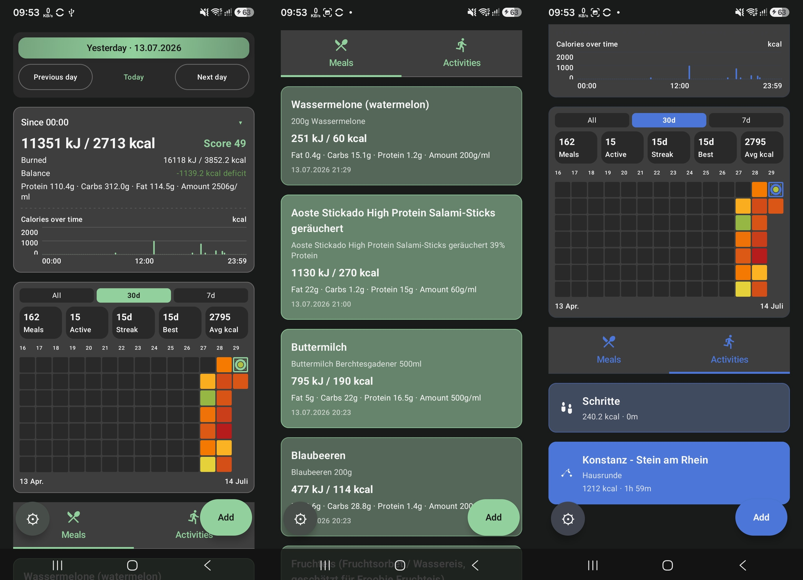

# Vocalorie

Vocalorie is a personal Android app for tracking meals and activities, using an LLM to turn a spoken or typed food description into a full nutrition estimate.



## Install on a connected device

With a device connected via `adb`:

```bash
./gradlew :app:installDebug --no-daemon
```
